# ☁️ Lab Avançado: Engenharia de Nuvem, Alta Disponibilidade e Serverless

## 🎯 Objetivo do Projeto
O objetivo deste projeto foi aplicar padrões arquiteturais modernos exigidos em ambientes de produção de larga escala[cite: 6]. A infraestrutura foi desenhada para se auto-recuperar de falhas (Self-Healing), escalar dinamicamente baseado em estresse de CPU (Auto Scaling), otimizar custos (FinOps) e delegar processamentos assíncronos para componentes Serverless[cite: 6].

## 🛠️ Stack Tecnológico e Ferramentas
*   **Computação e Escalabilidade:** Amazon EC2 (Launch Templates), Auto Scaling Group (ASG), Application Load Balancer (ALB) e AWS Lambda (Serverless com Layers)[cite: 6].
*   **Redes e Governança:** VPC Multi-AZ, VPC Endpoints (AWS Private Link), AWS IAM (Princípio do Menor Privilégio) e SSM Parameter Store (Cofre de Segredos)[cite: 6].
*   **Armazenamento e Banco de Dados:** Amazon RDS (MySQL 8.0 com criptografia) e Amazon S3 (Buckets lógicos raw e processed)[cite: 6].
*   **Integração e Containers:** Docker, Python 3.12 (Pillow, Flask) e Scripts de Chaos Engineering para testes de carga[cite: 6].

---

## 🏗️ Arquitetura e Decisões Técnicas

### 1. Redes, Alta Disponibilidade e FinOps
Provisionei uma VPC baseada no padrão Multi-AZ para suportar a arquitetura dinâmica e tolerante a falhas[cite: 6]. A rede foi segmentada em Sub-redes Públicas (Balanceadores) e Privadas (Persistência)[cite: 6]. Focado em FinOps, optei por não utilizar um NAT Gateway (alto custo) e implementei conexões via VPC Endpoints, garantindo comunicação privada com os serviços AWS[cite: 6].

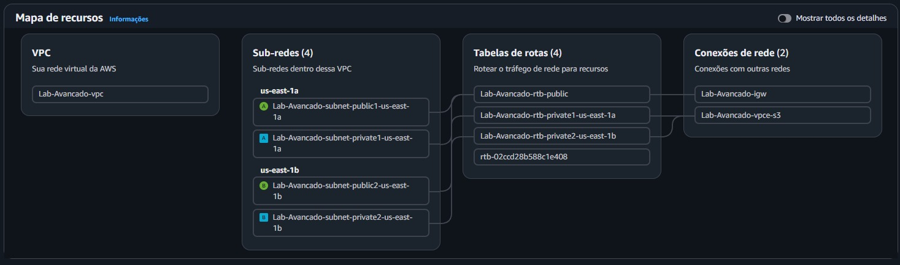

O Amazon RDS foi posicionado estrategicamente na rede privada com regras rigorosas de Zero Trust[cite: 6].
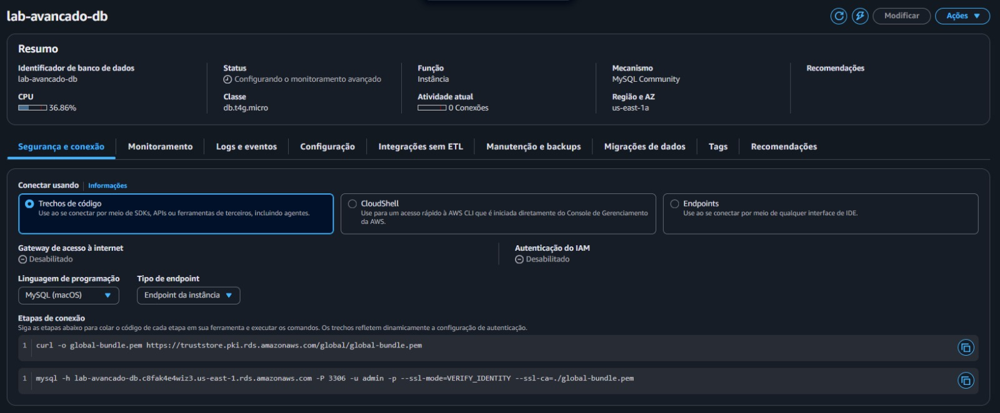
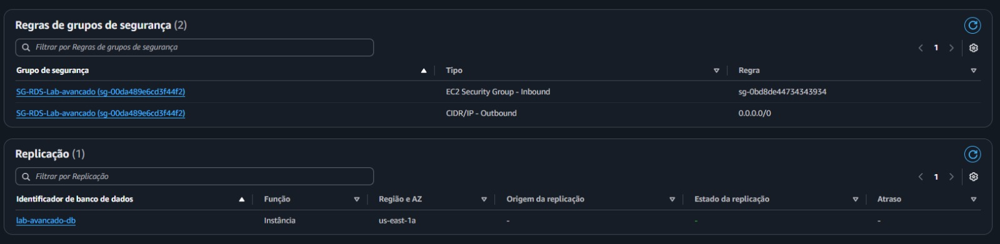

### 2. Governança IAM e Cofre de Segredos (SSM)
Abandonei credenciais em código (hardcoding). Criei estruturas lógicas de perfis IAM limitando o escopo da frota EC2 aos serviços necessários[cite: 6]. A senha do banco foi alocada no SSM Parameter Store, sendo recuperada via API apenas em tempo de execução[cite: 6].

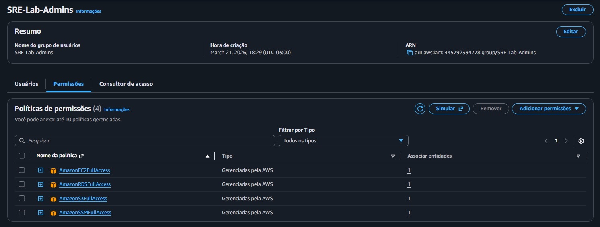
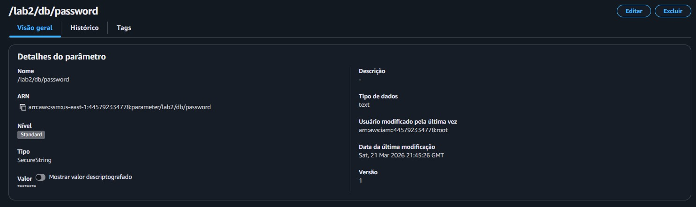
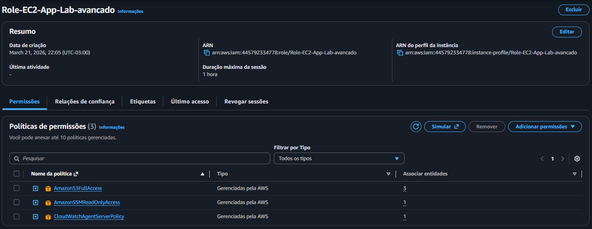

### 3. Infraestrutura Imutável e Containers
Migrei de um modelo Bare-metal (Pets) para Infraestrutura Imutável (Cattle)[cite: 6]. As instâncias EC2 nascem bloqueadas para acessos manuais, padronizadas via Launch Templates, e executam um User Data que orquestra o container Docker na inicialização[cite: 6].

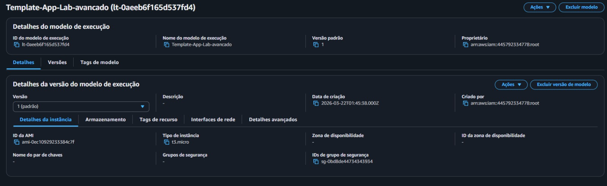
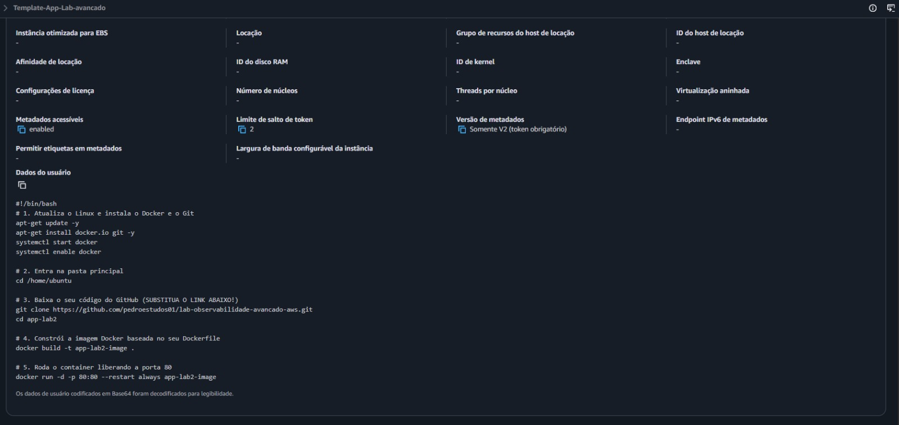
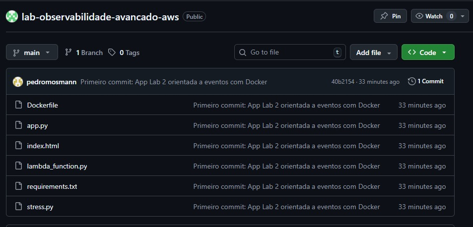

*(Nota: O desenvolvimento inicial contou com apoio de IA para alavancagem de produtividade)*
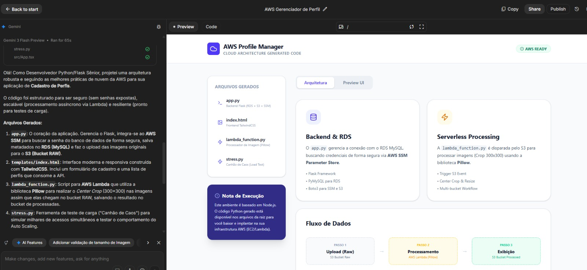

### 4. Arquitetura Orientada a Eventos (Serverless)
Para evitar gargalos, apliquei o padrão Event-Driven[cite: 6]. O processamento pesado de imagens foi isolado em uma AWS Lambda, engatilhada automaticamente por eventos `s3:ObjectCreated` no bucket raiz (raw), enviando o resultado para o bucket de destino (processed)[cite: 6].

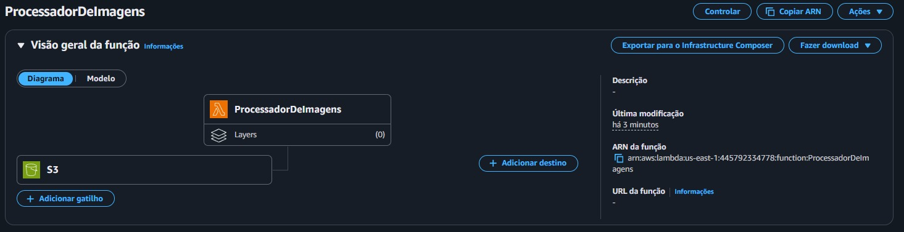
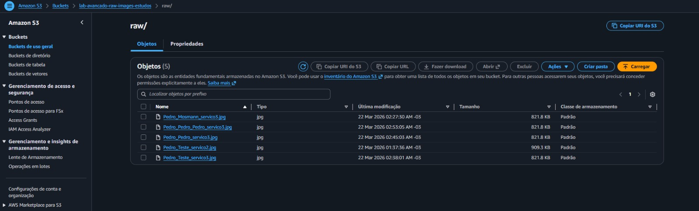
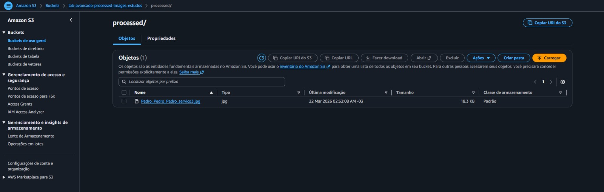

### 5. Alta Disponibilidade e Auto Scaling
Implementei um Application Load Balancer roteando requisições para o Auto Scaling Group (ASG) com políticas de Target Tracking (CPU > 50%)[cite: 6]. Ativei Health Checks do ELB integrados ao ASG para garantir o comportamento de Self-Healing em caso de travamentos[cite: 6].

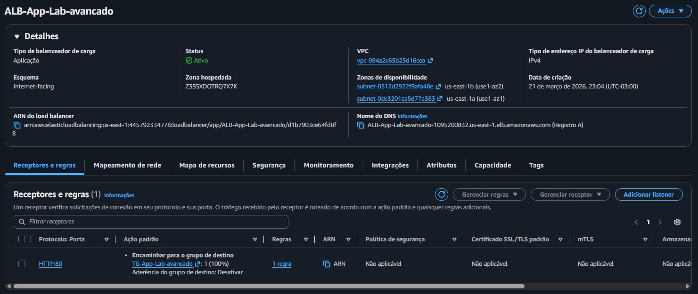
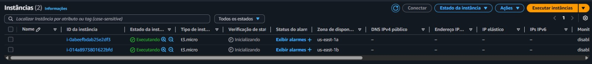
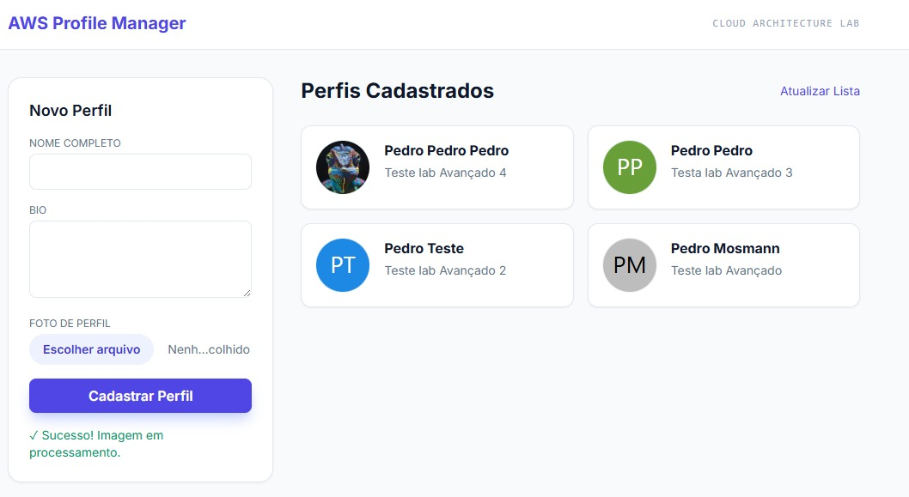

---

## 🔬 Chaos Engineering e Elasticidade
Executei scripts matemáticos pesados para saturar as CPUs das instâncias intencionalmente e homologar a resiliência arquitetural[cite: 6].

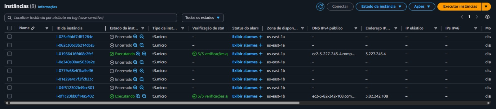
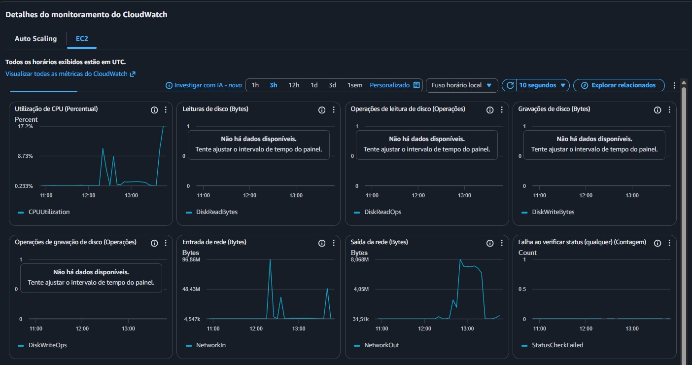

A infraestrutura detectou o gargalo e iniciou os eventos de Scale-out automatizados, provisionando servidores auxiliares para absorver o tráfego[cite: 6].

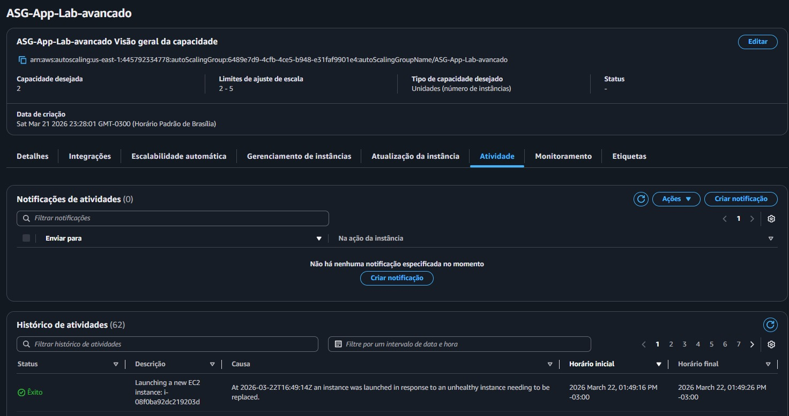
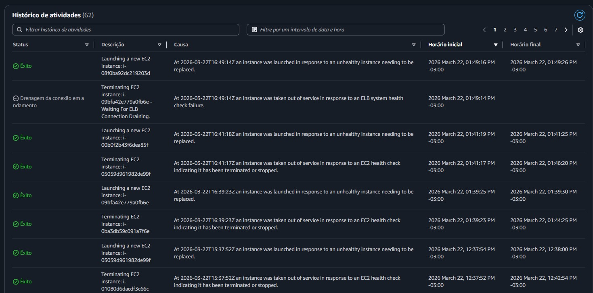
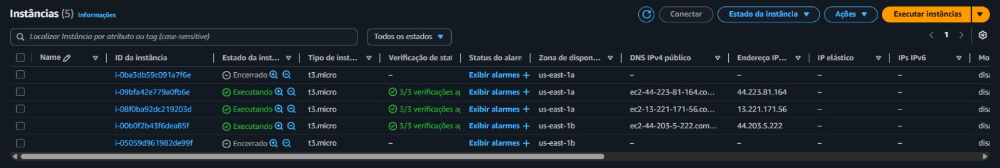

---

## 🚨 Troubleshooting e Runbook de Incidentes
Documentação dos incidentes isolados e resolvidos durante a construção da arquitetura[cite: 6]:

*   **ERRO DE ACESSO AO COFRE (SSM Agent):** A instância EC2 nasceu sem permissões para ler o SSM[cite: 6]. **Solução:** Atualização do Launch Template anexando o Instance Profile com políticas de leitura específicas[cite: 6].
*   **ERRO DE COMPILAÇÃO CONTAINER (Pillow wheel):** A imagem `python:3.14-slim` não possuía pacotes C compilados nativamente[cite: 6]. **Solução:** Downgrade seguro no Dockerfile para a LTS `python:3.12-slim`[cite: 6].
*   **ERRO DE CRIPTOGRAFIA RDS (caching_sha2_password):** MySQL 8.0 exige autenticação criptografada não suportada pelo PyMySQL puro[cite: 6]. **Solução:** Injeção do pacote `cryptography` via `requirements.txt` no container[cite: 6].
*   **ERRO LÓGICO DE DADOS (Unknown database):** O código falhava ao conectar em um banco inexistente no RDS recém-criado[cite: 6]. **Solução:** Refatoração para forçar uma conexão root isolada realizando o `CREATE DATABASE IF NOT EXISTS` previamente[cite: 6].
*   **ERRO DEPENDÊNCIAS LAMBDA (No module PIL):** O runtime minimalista da Lambda não possui bibliotecas gráficas nativas[cite: 6]. **Solução:** Implementação de uma Lambda Layer utilizando o repositório público Klayers[cite: 6].
*   **ERRO DE SEGURANÇA S3 (ACL Blocked):** Políticas modernas da AWS ativam Bucket Owner Enforced por padrão[cite: 6]. **Solução:** Remoção de tentativas locais de `ACL='public-read'` via código boto3 e substituição por uma Bucket Policy global na AWS[cite: 6].
*   **FALSO NEGATIVO NO AUTO SCALING (I/O vs CPU):** Testes de carga comuns esgotavam conexões de rede (I/O Bound) mantendo a CPU em 11%[cite: 6]. **Solução:** Criação de uma rota intencionalmente pesada resolvendo cálculos matemáticos milionários para forçar saturação de CPU (CPU Bound) e testar o gatilho corretamente[cite: 6].