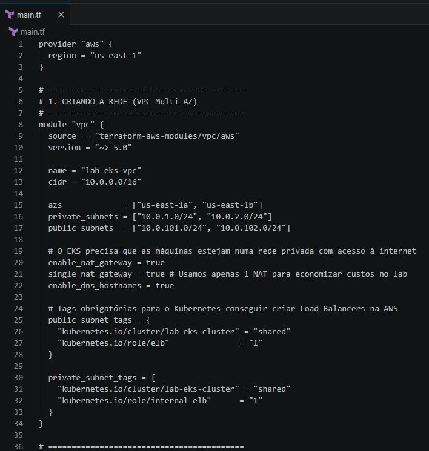
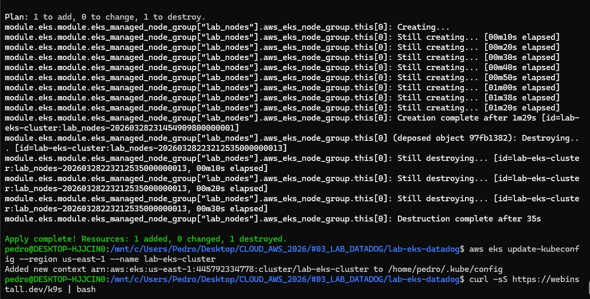
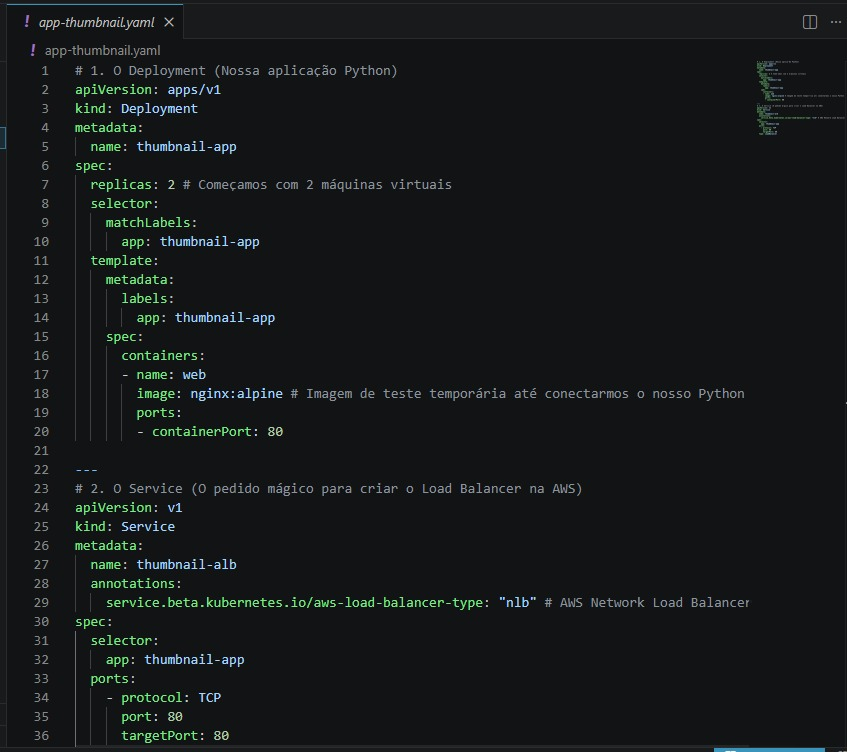
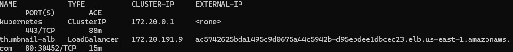
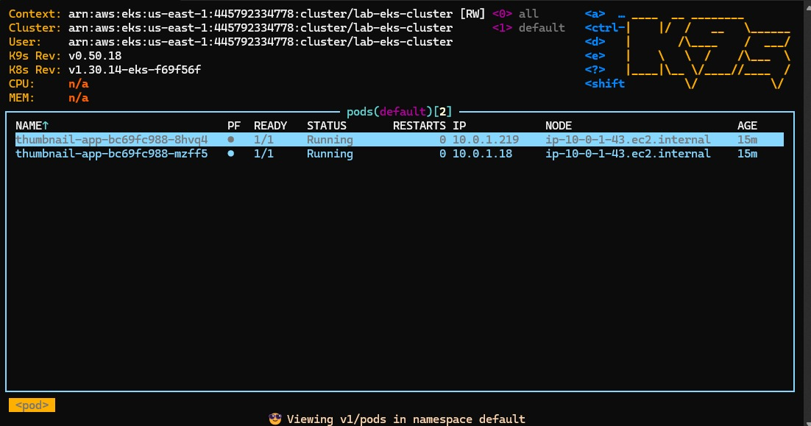
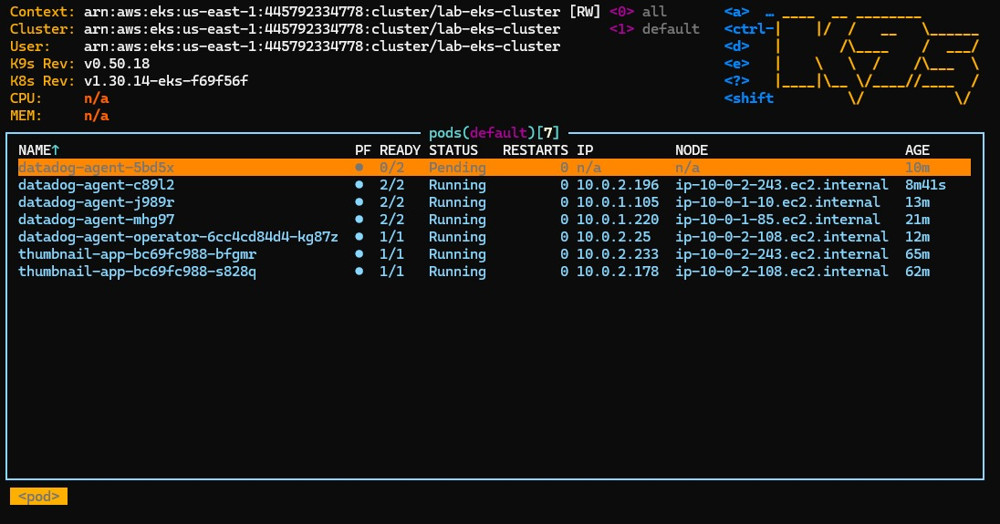
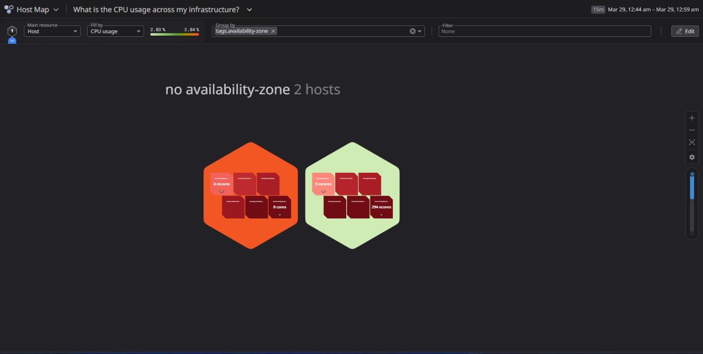

# ☁️ Lab Avançado: Infraestrutura como Código (IaC), Orquestração (EKS) e Observabilidade (Datadog)

## 🎯 Objetivo do Projeto
O objetivo deste projeto foi aplicar padrões arquiteturais modernos exigidos em ambientes de produção baseados em microsserviços[cite: 7]. O provisionamento manual foi substituído por Infraestrutura como Código (IaC), Orquestração de Containers e Observabilidade avançada[cite: 7]. A infraestrutura foi desenhada para evidenciar a integração nativa entre o Kubernetes e a AWS, além de expor desafios reais de Capacity Planning enfrentados por SREs em cenários de recursos restritos[cite: 7].

## 🛠️ Stack Tecnológico e Ferramentas
*   **Computação e Orquestração:** Terraform (IaC declarativo e idempotente), Amazon EKS (Control Plane gerenciado) e K9s (CLI para governança e observabilidade em tempo real)[cite: 7].
*   **Redes e Tráfego:** AWS VPC (Multi-AZ preparada para EKS) e AWS Network Load Balancer (NLB) provisionado nativamente via Kubernetes[cite: 7].
*   **Observabilidade:** Datadog Agent (Mapeamento de dependências e métricas de host via DaemonSet)[cite: 7].

---

## 🏗️ Arquitetura e Decisões Técnicas

### 1. Infraestrutura como Código (IaC) e Topologia de Rede
Abandonei completamente a abordagem manual (ClickOps) no console da AWS[cite: 7]. Adotei o Terraform para provisionar a rede VPC Multi-AZ de forma idempotente[cite: 7]. 

Uma decisão arquitetural vital foi a injeção de Tags específicas (`kubernetes.io/role/elb`) diretamente no código Terraform[cite: 7]. Sem essas tags prévias na infraestrutura de rede, o cluster EKS não teria governança ou permissão para solicitar balanceadores públicos na rede AWS[cite: 7].

### 2. Orquestração e Integração AWS
A comunicação entre o orquestrador (Kubernetes) e o provedor de nuvem (AWS) foi configurada de forma fluida. O provisionamento do Network Load Balancer (NLB) ocorreu automaticamente a partir da leitura das anotações (annotations) dentro do manifesto YAML da aplicação[cite: 7].

### 3. Alta Disponibilidade e Observabilidade em Tempo Real (K9s)
Para garantir a saúde da aplicação, utilizei a interface K9s. A ferramenta comprova a alta disponibilidade da infraestrutura: a aplicação operou de forma saudável (`Running`), distribuída dinamicamente nos nós do cluster e pronta para suportar o tráfego do balanceador[cite: 7].

### 4. O Desafio de Capacity Planning e Observabilidade Avançada (Datadog)
Para eliminar pontos cegos (Blind Spots) da operação, realizei a integração com a plataforma Datadog[cite: 7]. O painel visual comprovou o sucesso da coleta de métricas em tempo real das instâncias EC2 subjacentes do cluster EKS, categorizadas fisicamente por Zonas de Disponibilidade[cite: 7].

**A Realidade FinOps:** A inserção de agentes de observabilidade revelou o maior desafio arquitetural do laboratório: Limites Físicos de Hardware[cite: 7]. O Datadog Agent exige presença em todas as máquinas via `DaemonSet`. Em instâncias limitadas do *Free Tier*, essa ferramenta corporativa competiu por memória residual com a infraestrutura nativa do EKS[cite: 7]. 

O K9s evidenciou o *Scheduler* do Kubernetes atuando em defesa do sistema, deixando os agentes de monitoramento em estado de espera (`Pending`) por absoluta falta de recursos de CPU/RAM[cite: 7].

---

## 🚨 Troubleshooting e Runbook de Incidentes
O valor de um profissional de SRE prova-se na capacidade de diagnosticar e isolar gargalos arquiteturais[cite: 7]. Abaixo, o Runbook dos incidentes deste laboratório:

*   **ERRO DE INTEGRAÇÃO DE BALANCEAMENTO (EKS não provisiona o Load Balancer):**
    *   **Causa:** O orquestrador não sabia em quais sub-redes da VPC ele tinha permissão de nuvem para injetar IPs públicos[cite: 7].
    *   **Solução:** Alteração arquitetural diretamente no IaC (`main.tf`), inserindo as chaves `kubernetes.io/role/elb = "1"` nas Sub-redes Públicas e `internal-elb` nas Privadas, garantindo que o Kubernetes assumisse a governança sobre a VPC[cite: 7].
*   **ERRO DE ALOCAÇÃO DE PODS DE MONITORAMENTO (Status `Pending` no K9s):**
    *   **Causa:** Dimensionamento de laboratório atrelado ao AWS Free Tier (instâncias `t3.micro`)[cite: 7]. A execução do Datadog Agent forçou o limite de hardware, obrigando o orquestrador a barrar o deploy para evitar um desastre por OOM Kill (Out of Memory)[cite: 7].
    *   **Aprendizado (FinOps/Capacity Planning):** O isolamento preciso deste gargalo físico prova que a resolução não seria "reiniciar o servidor", mas sim executar um *Scale-Up* das máquinas (ex: `t3.medium`). Este diagnóstico gera a documentação de Capacity Planning que embasa diretamente o orçamento de TI e a tomada de decisão gerencial em ambientes produtivos[cite: 7].