# ☁️ Lab Raiz: Arquitetura Clássica de 3 Camadas na AWS (Bare-metal)

## 🎯 Objetivo do Projeto
O objetivo deste projeto não é apenas "subir um servidor", mas demonstrar o domínio sobre os fundamentos de uma arquitetura em nuvem segura, escalável e monitorável[cite: 5]. Antes de utilizar automação avançada, construí esta infraestrutura "raiz" do zero para compreender profundamente a camada de redes (VPC), os bloqueios de segurança (Zero Trust) e o forte acoplamento do Sistema Operacional com a aplicação[cite: 5].

## 🛠️ Stack Tecnológico e Ferramentas
*   **Computação:** Amazon EC2 (Ubuntu Server 24.04 LTS), Bash Scripting (User Data) para automação de bootstrap e uso de ambientes virtuais Python[cite: 5].
*   **Redes e Segurança:** Amazon VPC (Sub-redes Públicas e Privadas), Internet Gateway, Security Groups (Zero Trust) e AWS Managed Prefix Lists[cite: 5].
*   **Armazenamento e Banco de Dados:** Amazon S3 (Static Website Hosting Serverless) e Amazon RDS (MySQL protegido em sub-rede privada)[cite: 5].
*   **Observabilidade e Caos:** Amazon CloudWatch, CloudWatch Agent, Amazon SNS e Apache Benchmark (ab) para testes de carga sintéticos[cite: 5].
*   **Desenvolvimento:** Python 3 (Flask, PyMySQL), CORS e Git/GitHub com `.gitignore` configurado para Shift-Left Security[cite: 5].

---

## 🏗️ Arquitetura e Decisões Técnicas

### 1. Redes e Segurança (Zero Trust)
Desenhei uma VPC customizada separando a infraestrutura em camadas lógicas: uma Sub-rede Pública voltada para a internet (Frontend/API) e uma Sub-rede Privada dedicada exclusivamente à persistência de dados (RDS)[cite: 5].

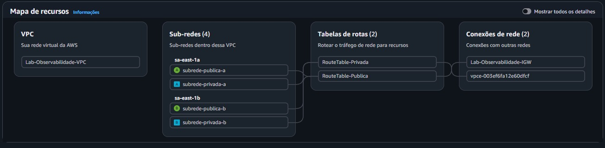

Implementei políticas de 'Zero Trust' nos Security Groups[cite: 5]. O acesso ao banco de dados foi restrito para aceitar conexões unicamente da EC2[cite: 5]. 

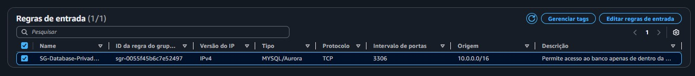

Para administração, evitei a abertura global da porta SSH utilizando AWS Managed Prefix Lists, garantindo acesso auditável via EC2 Instance Connect[cite: 5].

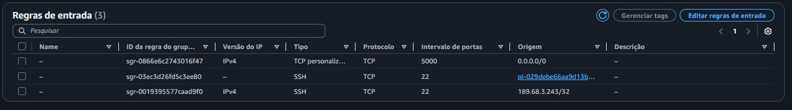

### 2. Computação Bare-metal e Banco de Dados
A aplicação foi instalada diretamente no SO da EC2, evidenciando o acoplamento tradicional (Bare-metal)[cite: 5]. Como o Amazon RDS estava isolado na Sub-rede Privada, utilizei a instância EC2 como um 'Bastion Host' lógico para executar scripts de injeção de dados (Data Seeding) no RDS isolado[cite: 5].

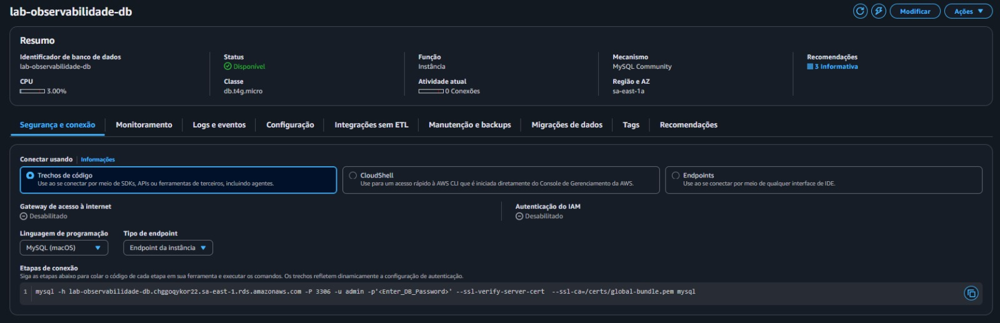

### 3. Integração Frontend (S3 Serverless)
O Frontend foi hospedado de forma Serverless utilizando o Amazon S3 configurado como Static Website[cite: 5].

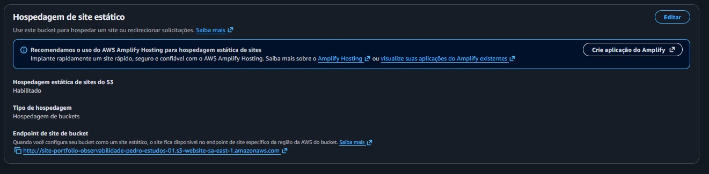

Configurei políticas de CORS no backend Python (Flask) para permitir requisições seguras vindas do domínio do S3 e validei a comunicação da API[cite: 5].

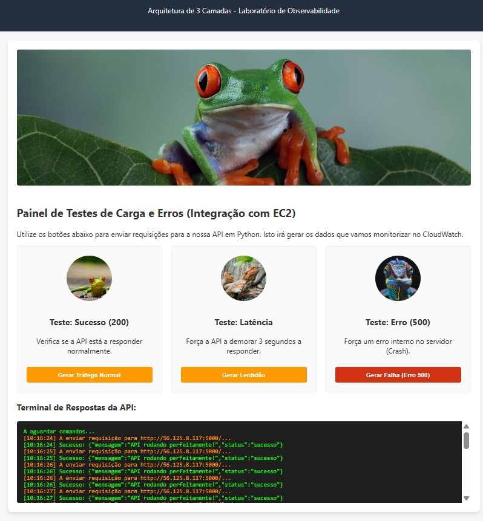
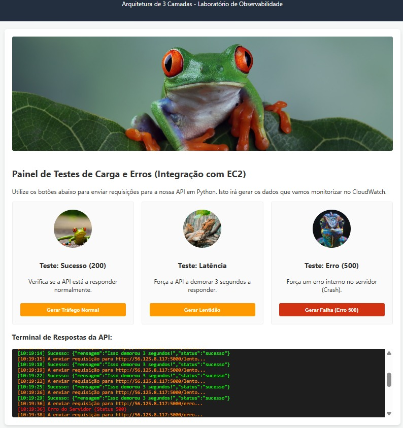

### 4. Ciclo de Vida do Git (Shift-Left Security)
Apliquei práticas de Shift-Left Security configurando o `.gitignore` preventivamente para bloquear injeções de credenciais e arquivos sensíveis no repositório público[cite: 5].

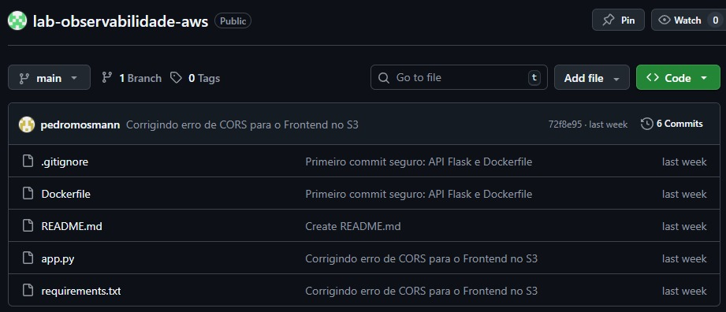

---

## 🔬 Engenharia do Caos e Observabilidade Proativa
Em vez de adotar um monitoramento reativo, utilizei o Apache Benchmark (ab) para realizar injeção de carga sintética (Chaos Engineering) e validar a degradação da CPU, além de gerar erros 500 forçados[cite: 5].

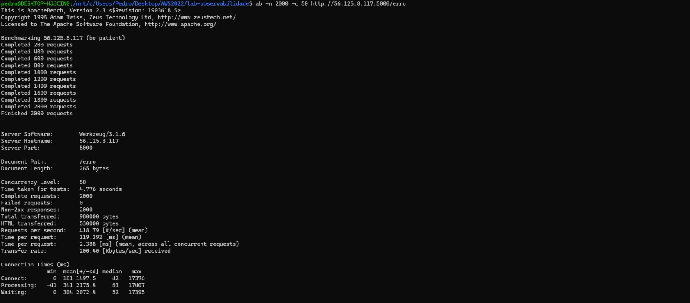
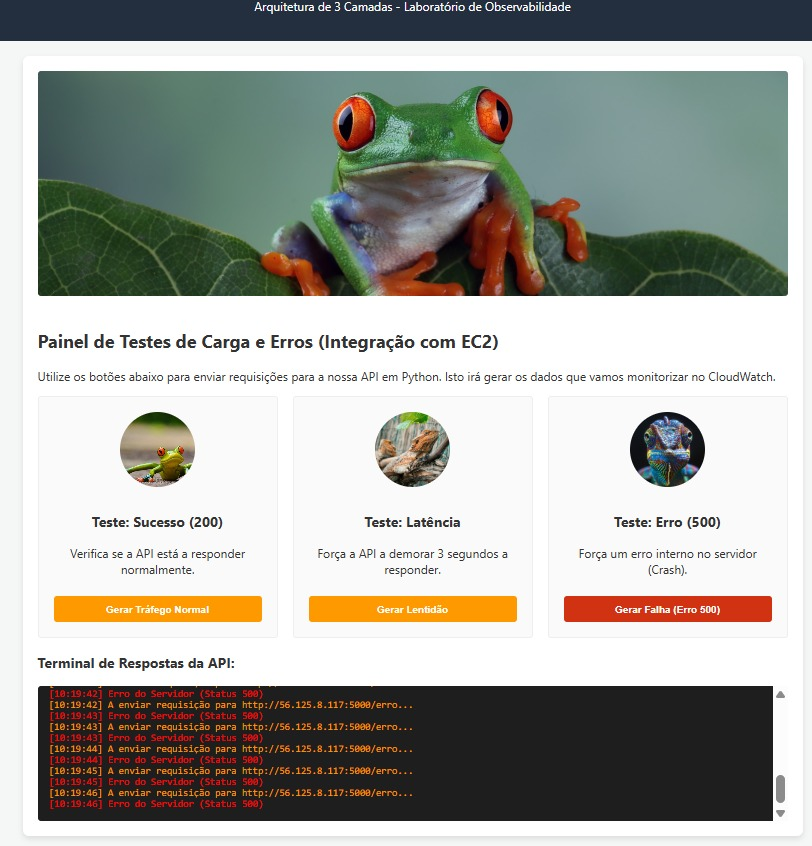

Transformei logs não-estruturados em métricas numéricas acionáveis via Metric Filters e configurei alertas integrados ao Amazon SNS[cite: 5]. Ajustei o período de avaliação com a regra de "Datapoints to Alarm" para evitar a Fadiga de Alarme (Alert Fatigue)[cite: 5].

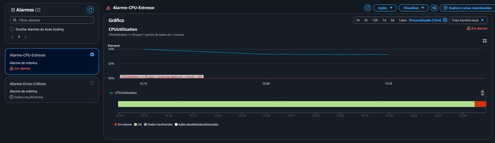
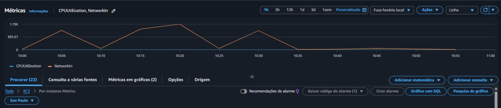

**Comprovação de Paging (Alertas em Tempo Real):**
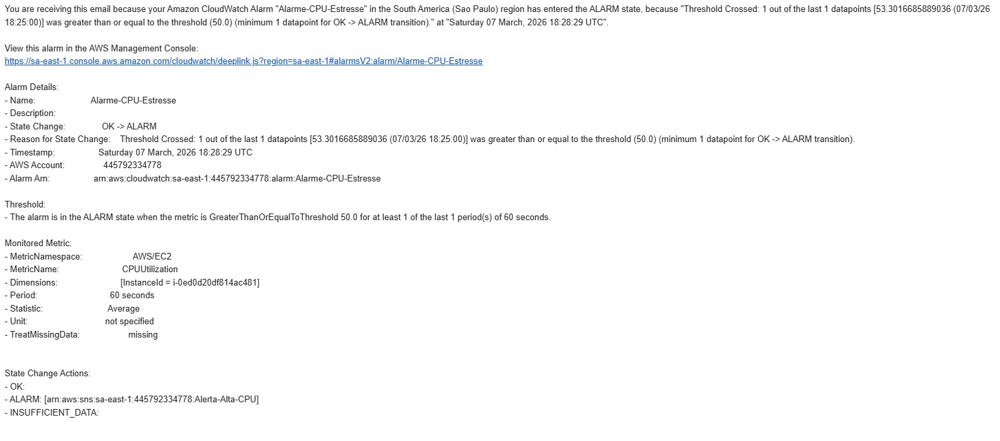
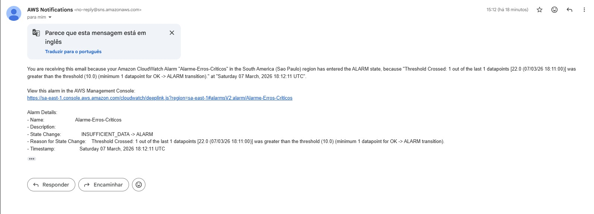

---

## 🚨 Troubleshooting e Runbook de Incidentes
Na Engenharia de Confiabilidade (SRE), o verdadeiro valor de um engenheiro está na capacidade de diagnosticar problemas, entender a causa raiz e aplicar a solução correta[cite: 5]. Abaixo o Runbook dos incidentes deste laboratório:

*   **ERRO DE INTEGRAÇÃO (CORS Blocked):** O navegador bloqueou requisições de origens diferentes do S3 para a EC2[cite: 5]. **Solução:** Instalação da biblioteca Flask-Cors no backend e recriação da instância[cite: 5].
*   **ERRO DE CONFLITO PIP (PEP 668):** Distribuições Linux modernas bloqueiam instalações globais via pip[cite: 5]. **Solução:** Criação de ambiente virtual isolado (`venv`) e instalação de pacotes dentro da bolha[cite: 5].
*   **ERRO DE ACESSO SSH (Timeout):** A política de Zero Trust limitava a porta 22 ao IP local bloqueando o console AWS[cite: 5]. **Solução:** Inclusão da AWS Managed Prefix List do EC2 Instance Connect nas regras de entrada[cite: 5].
*   **ERRO DE LOGS (500 Ausentes):** A execução em background (`nohup`) reteve logs na memória RAM via buffering[cite: 5]. **Solução:** Reinício da aplicação forçando o modo unbuffered com a flag `-u`[cite: 5].
*   **ERRO DE ALARME (Falso Negativo):** A média de 5 minutos do CloudWatch diluiu o pico do ataque sintético[cite: 5]. **Solução:** Redução do período de avaliação do alarme para 1 minuto e adoção de Datapoints to Alarm[cite: 5].
*   **ERRO DE CONTROLE DE VERSÃO (Push Rejeitado):** O GitHub possuía commits inexistentes na máquina local[cite: 5]. **Solução:** Executar `git pull origin main --rebase` antes do push[cite: 5].